# 🔬 Laboratory GOS Management System

<div align="center">

[](https://laravel.com)
[](https://php.net)
[](https://mysql.com)
[](https://developers.facebook.com/docs/whatsapp)

**🏛️ Laboratorium Gelombang, Optik dan Spektroskopi (GOS)**  
**Departemen Fisika FMIPA - Universitas Syiah Kuala**

*A comprehensive digital laboratory management system with WhatsApp integration*

[🚀 Features](#-features) • [⚡ Quick Start](#-quick-start) • [📱 WhatsApp Integration](#-whatsapp-integration) • [🛠️ API Documentation](#-api-documentation)

</div>

---

## 🌟 System Overview

<details>
<summary><b>🎯 What This System Does</b></summary>

The **Laboratory GOS Management System** is a complete digital solution for managing:

- **🔬 Equipment Borrowing** - Students can request laboratory equipment with real-time availability tracking
- **🏛️ Lab Visits** - Scheduled visits for groups, research teams, and educational purposes  
- **🧪 Testing Services** - Professional sample analysis with FTIR, UV-Vis, and optical microscopy
- **📊 Inventory Management** - Real-time equipment tracking, maintenance scheduling, and stock control
- **📱 WhatsApp Notifications** - Automatic notifications for all stakeholders via WhatsApp Business API

```mermaid
graph TB
    A[👥 Users] --> B[🌐 Frontend React/Vue]
    B --> C[🔗 Laravel API]
    C --> D[🗄️ MySQL Database]
    C --> E[📱 WhatsApp Business API]
    C --> F[📁 File Storage]
    
    subgraph "Core Modules"
        G[Equipment Management]
        H[Request Processing]
        I[User Management]
        J[Notification System]
    end
    
    C --> G
    C --> H
    C --> I
    C --> J
```

</details>

<details>
<summary><b>🏗️ System Architecture</b></summary>



</details>

---

## 🚀 Features

### 🎮 Core Laboratory Services

<table>
<tr>
<td width="33%">

#### 🔬 **Equipment Borrowing**
- Real-time availability checking
- Automatic stock reservation
- Operational hours validation
- Multi-item requests
- Equipment condition tracking

</td>
<td width="33%">

#### 🏛️ **Lab Visit Management**
- Group visit scheduling
- Capacity management
- Purpose-based filtering
- Agreement verification
- Visit time optimization

</td>
<td width="33%">

#### 🧪 **Testing Services**
- FTIR Spectroscopy
- UV-Vis Spectroscopy  
- Optical Microscopy
- Custom testing protocols
- Sample tracking & results

</td>
</tr>
</table>

### ⚡ Advanced Features

<details>
<summary><b>📱 WhatsApp Business Integration</b></summary>

- **Automatic Notifications**: Real-time updates via WhatsApp
- **Template System**: 6 pre-built message templates
- **Multi-stakeholder**: Notifications for clients, admins, and supervisors
- **Retry Mechanism**: Reliable message delivery
- **Phone Validation**: Indonesian phone number format support

```php
// Example: Automatic notification when request is submitted
🔬 *Lab GOS - USK*

Halo Dr. Jane Smith,

Permohonan peminjaman alat laboratorium telah diterima:
📋 ID: BR20250811001
📅 Tanggal: 15 Agustus 2025
⏰ Waktu: 08:30 - 11:00
🎯 Tujuan: Research experiment

Status: ⏳ Menunggu Persetujuan
```

</details>

<details>
<summary><b>🔐 Security & Authentication</b></summary>

- **Laravel Sanctum**: API token authentication
- **Role-based Access**: Admin, staff, and user permissions
- **CORS Protection**: Configured for frontend integration
- **File Upload Security**: Type validation and secure storage
- **Activity Logging**: Complete audit trails with Spatie ActivityLog

</details>

<details>
<summary><b>📊 Smart Inventory Management</b></summary>

- **Real-time Stock Tracking**: Automatic quantity updates
- **Equipment Reservations**: Prevent double-booking
- **Condition Monitoring**: Track equipment health
- **Maintenance Scheduling**: Automated reminders
- **Low Stock Alerts**: Prevent service disruptions

</details>

---

## ⚡ Quick Start

### 🐳 Docker Setup (Recommended)

```bash
# Clone the repository
git clone https://github.com/notsuperganang/lab-gos-management-system.git
cd lab-gos-management-system

# Start with Docker
docker-compose up -d

# Install dependencies
docker-compose exec app composer install
docker-compose exec app php artisan key:generate
docker-compose exec app php artisan migrate:fresh --seed

# Create storage link
docker-compose exec app php artisan storage:link

# 🚀 Ready! Visit http://localhost:8000
```

### 💻 Manual Setup

<details>
<summary><b>Prerequisites & Installation Steps</b></summary>

**Requirements:**
- PHP 8.2+
- MySQL 8.0+
- Composer 2.0+
- Node.js 18+ (for frontend assets)

```bash
# 1. Clone and setup
git clone https://github.com/notsuperganang/lab-gos-management-system.git
cd lab-gos-management-system
composer install

# 2. Environment configuration
cp .env.example .env
php artisan key:generate

# 3. Database setup
mysql -u root -p
CREATE DATABASE laboratorium_gos;
exit

# 4. Run migrations and seed data
php artisan migrate:fresh --seed

# 5. Storage setup
php artisan storage:link

# 6. Development server
composer dev  # Starts Laravel + Queue + Logs + Vite
```

</details>

### 🔧 Environment Configuration

<details>
<summary><b>Essential Environment Variables</b></summary>

```bash
# Database
DB_CONNECTION=mysql
DB_HOST=127.0.0.1
DB_PORT=3306
DB_DATABASE=laboratorium_gos
DB_USERNAME=root
DB_PASSWORD=

# WhatsApp Business API
WHATSAPP_ENABLED=true
WHATSAPP_API_URL=https://graph.facebook.com/v17.0
WHATSAPP_PHONE_NUMBER_ID=your_phone_number_id
WHATSAPP_ACCESS_TOKEN=your_access_token

# Admin Contacts (for notifications)
WHATSAPP_ADMIN_PHONE_1=+628123456789
WHATSAPP_ADMIN_PHONE_2=+628987654321
WHATSAPP_LAB_PHONE=+62651755555

# CORS (for frontend)
FRONTEND_URL=http://localhost:3000
SANCTUM_STATEFUL_DOMAINS=localhost:3000,localhost:8080
```

</details>

---

## 📱 WhatsApp Integration

### 🚀 Setup WhatsApp Business API

<details>
<summary><b>Step-by-step WhatsApp Configuration</b></summary>

1. **Create Facebook App**:
   ```bash
   # Visit: https://developers.facebook.com/apps/
   # Create new app → Business → WhatsApp
   ```

2. **Get Phone Number ID**:
   ```bash
   # WhatsApp → API Setup → Phone Number ID
   WHATSAPP_PHONE_NUMBER_ID=123456789012345
   ```

3. **Generate Access Token**:
   ```bash
   # WhatsApp → API Setup → Temporary Token
   WHATSAPP_ACCESS_TOKEN=your_long_access_token
   ```

4. **Test Configuration**:
   ```bash
   php artisan tinker
   
   # Test WhatsApp service
   $whatsapp = app(\App\Services\WhatsAppService::class);
   $result = $whatsapp->sendMessage('+6281234567890', 'Test message');
   dd($result);
   ```

</details>

### 📋 Message Templates

The system includes 6 pre-built templates:

| Template | Purpose | Trigger |
|----------|---------|---------|
| `borrow-request-submitted.txt` | Confirm equipment borrow request | Auto on submission |
| `borrow-request-approved.txt` | Approval notification | Admin approves |
| `visit-request-submitted.txt` | Visit confirmation | Auto on submission |
| `testing-request-submitted.txt` | Testing request receipt | Auto on submission |
| `admin-new-borrow-request.txt` | Admin alert | New borrow request |
| `admin-new-visit-request.txt` | Admin alert | New visit request |

---

## 🛠️ API Documentation

### 🔗 Public Endpoints

<details>
<summary><b>Equipment & Catalog Management</b></summary>

```http
# Get equipment catalog
GET /api/equipment
GET /api/equipment/{id}
GET /api/categories

# Equipment availability
GET /api/equipment/{id}/availability?date=2025-08-15&start_time=09:00&end_time=15:00
```

</details>

<details>
<summary><b>Request Submissions</b></summary>

```http
# Submit equipment borrow request
POST /api/requests/borrow
Content-Type: application/json

{
  "members": [
    {
      "name": "John Doe",
      "nim": "1234567890",
      "study_program": "Physics"
    }
  ],
  "supervisor_name": "Dr. Jane Smith",
  "supervisor_email": "jane.smith@university.ac.id",
  "supervisor_phone": "+6281234567890",
  "purpose": "Research experiment",
  "borrow_date": "2025-08-15",
  "return_date": "2025-08-16",
  "start_time": "08:30",
  "end_time": "11:00",
  "equipment_items": [
    {
      "equipment_id": 1,
      "quantity_requested": 1,
      "notes": "Handle with care"
    }
  ]
}

# Submit lab visit request
POST /api/requests/visit

# Submit testing request
POST /api/requests/testing

# Track requests
GET /api/tracking/borrow/{request_id}
GET /api/tracking/visit/{request_id}
GET /api/tracking/testing/{request_id}
```

</details>

### 🔐 Admin Endpoints (Authenticated)

<details>
<summary><b>Request Management</b></summary>

```http
# Authentication required: Bearer token
Authorization: Bearer your-sanctum-token

# Get all requests with filtering
GET /api/admin/requests/borrow?status=pending&date_from=2025-08-01
GET /api/admin/requests/visit?purpose=research
GET /api/admin/requests/testing?urgent=true

# Approve/reject requests
PUT /api/admin/requests/borrow/{id}/approve
PUT /api/admin/requests/borrow/{id}/reject

# Equipment management
GET /api/admin/equipment
POST /api/admin/equipment
PUT /api/admin/equipment/{id}
DELETE /api/admin/equipment/{id}
```

</details>

---

## 🧪 Testing

### ✅ Test Coverage

<details>
<summary><b>Run Test Suite</b></summary>

```bash
# Run all tests
composer test

# Run specific test types
php artisan test --filter=Equipment
php artisan test --filter=WhatsApp
php artisan test --filter=Request

# Test with coverage
php artisan test --coverage-html coverage/
```

**Test Categories:**
- ✅ **Unit Tests**: Models, Services, Utilities
- ✅ **Feature Tests**: API endpoints, Authentication  
- ✅ **Integration Tests**: WhatsApp, File uploads, Database
- ✅ **Browser Tests**: End-to-end user workflows

</details>

### 🚀 Manual Testing Workflow

<details>
<summary><b>Complete End-to-End Testing</b></summary>

**1. Equipment Borrow Request:**
```bash
# Test complete workflow
curl -X POST http://localhost:8000/api/requests/borrow \
  -H "Content-Type: application/json" \
  -d @test-data/borrow-request.json

# Expected: BR20250811001 with WhatsApp notifications
```

**2. Admin Approval:**
```bash
# Approve request (requires auth)
curl -X PUT http://localhost:8000/api/admin/requests/borrow/1/approve \
  -H "Authorization: Bearer $TOKEN" \
  -H "Content-Type: application/json" \
  -d '{"approval_notes": "Approved for research purposes"}'
```

**3. Equipment Return:**
```bash
# Mark as completed
curl -X PUT http://localhost:8000/api/admin/requests/borrow/1 \
  -H "Authorization: Bearer $TOKEN" \
  -d '{"status": "completed"}'
```

</details>

---

## 📁 Project Structure

<details>
<summary><b>📂 Directory Layout</b></summary>

```
lab-gos-management-system/
├── 🎨 app/
│   ├── Http/Controllers/
│   │   ├── Api/Admin/          # Admin management
│   │   └── Api/Public/         # Public endpoints
│   ├── Models/                 # Eloquent models
│   ├── Services/               # Business logic
│   │   ├── WhatsAppService     # WhatsApp integration
│   │   └── NotificationService # Multi-channel notifications
│   ├── Observers/              # Model observers
│   └── Http/Resources/         # API resources
├── 🗄️ database/
│   ├── migrations/             # Database schema
│   └── seeders/               # Sample data
├── ⚙️ config/
│   ├── whatsapp.php           # WhatsApp configuration
│   └── cors.php               # CORS settings
├── 📁 storage/app/
│   ├── public/                # Public file storage
│   │   ├── equipment/         # Equipment images
│   │   ├── articles/          # Article images
│   │   └── gallery/           # Gallery images
│   └── templates/             # WhatsApp templates
└── 🌐 routes/
    ├── api.php                # API routes
    └── web.php                # Web routes
```

</details>

---

## 🤝 Contributing

<details>
<summary><b>Development Guidelines</b></summary>

### 🔄 Workflow

1. **Fork & Clone**:
   ```bash
   git clone https://github.com/notsuperganang/lab-gos-management-system.git
   cd lab-gos-management-system
   git checkout -b feature/your-feature-name
   ```

2. **Development**:
   ```bash
   # Install dependencies
   composer install
   npm install
   
   # Run development environment
   composer dev
   ```

3. **Testing**:
   ```bash
   # Run tests before committing
   composer test
   php artisan pint  # Code formatting
   ```

4. **Submit PR**:
   ```bash
   git add .
   git commit -m "feat: add your feature description"
   git push origin feature/your-feature-name
   ```

### 📝 Code Standards

- **PHP**: Follow PSR-12 coding standard
- **Laravel**: Use Laravel best practices
- **Tests**: Write tests for new features
- **Documentation**: Update relevant docs

</details>

---

## 🔧 Troubleshooting

<details>
<summary><b>Common Issues & Solutions</b></summary>

### 🐛 WhatsApp Not Sending Messages

```bash
# Check WhatsApp configuration
php artisan tinker
config('whatsapp.enabled')  # Should be true
config('whatsapp.api_url')  # Should be set

# Test manually
$service = app(\App\Services\WhatsAppService::class);
$result = $service->sendMessage('+6281234567890', 'Test');
```

### 🗄️ Database Issues

```bash
# Reset database
php artisan migrate:fresh --seed

# Check database connection
php artisan tinker
DB::connection()->getPdo()
```

### 📁 File Storage Issues

```bash
# Recreate storage link
php artisan storage:link

# Check permissions
chmod -R 755 storage/
chmod -R 755 public/storage/
```

### 🔐 Authentication Issues

```bash
# Clear config cache
php artisan config:clear
php artisan cache:clear

# Generate new key
php artisan key:generate
```

</details>

---

## 📊 System Statistics

<div align="center">

| Metric | Value |
|--------|--------|
| **🔬 Equipment Types** | 15+ Categories |
| **📱 WhatsApp Templates** | 6 Message Types |
| **🔗 API Endpoints** | 25+ Routes |
| **📋 Request Types** | 3 Core Workflows |
| **⚡ Response Time** | < 200ms Average |
| **🛡️ Security Features** | 8+ Implementations |

</div>

---

## 📝 License

This project is licensed under the **MIT License** - see the [LICENSE](LICENSE) file for details.

---

## 🎉 Acknowledgments

<div align="center">

**Built with ❤️ for Laboratorium GOS - Universitas Syiah Kuala**

Special thanks to:
- **🏛️ Departemen Fisika FMIPA USK** - For project requirements and support
- **⚡ Laravel Community** - For the amazing framework and packages  
- **📱 WhatsApp Business API** - For reliable messaging infrastructure
- **🤖 Claude Code** - For AI-assisted development and optimization

---

### 🚀 Ready to Get Started?

```bash
git clone https://github.com/notsuperganang/lab-gos-management-system.git
cd lab-gos-management-system && composer dev
```

**🔗 Quick Links:** [Demo](http://localhost:8000) | [API Docs](http://localhost:8000/api/documentation) | [Issues](https://github.com/notsuperganang/lab-gos-management-system/issues) | [Wiki](https://github.com/notsuperganang/lab-gos-management-system/wiki)

</div>
